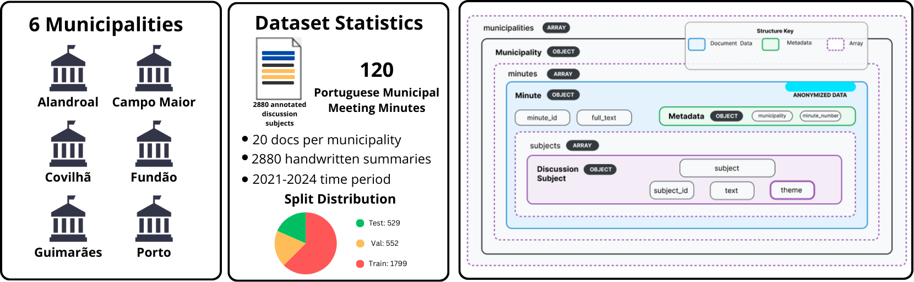

# CitiLink-Summ: A Dataset of Discussion Subjects Summaries in European Portuguese Municipal Meeting Minutes
[](LICENSE)
[](https://www.python.org/downloads/)
[](https://pytorch.org/)
[](https://huggingface.co/docs/transformers)
[]


Official repository for the accepted paper
**“CitiLink-Summ: A Dataset of Discussion Subjects Summaries in European Portuguese Municipal Meeting Minutes”**  
for **The Web Conference (WWW) 2026**.

This repository provides a **dataset sample**, **baseline implementations**, and the **summarization guidelines** used during data creation.

---

## 🧠 Overview

**CitiLink-Summ** introduces a new **benchmark dataset** for the summarization of *discussion subjects* extracted from European Portuguese municipal meeting minutes.  
It enables research on:

- domain-specific summarization,  
- low-resource languarge - European Portuguese,  
- structured municipal meeting documentation,  
- evaluation of LLMs and Encoder-Decoder Architectures under constrained public-administration contexts.

The benchmark includes manually curated abstractive summaries that condense the essential decisions and key points of municipal meetings.

---

## 📊 Project Status

The benchmark and the full set of baselines are implemented and reproducible.  
The *complete dataset* can be accessed through: https://rdm.inesctec.pt/dataset/2026-003.

---

## 🧩 Technology Stack

- **Language:** Python  
- **Frameworks:** PyTorch, Hugging Face Transformers  
- **Models:** BART (base/large), PRIMERA, PTT5,LED, Gemini Flash, Qwen  

---

## 🏗️ Architecture



The CitiLink-Summ workflow consists of:

1. **Dataset Preparation**  
   Processing of discussion subjects, metadata and expert-written summaries.

2. **Baseline Summarization**  
   Implementations using encoder–decoder Transformers, long-context models, and LLM APIs.

3. **Automatic Evaluation**  
   Metrics include ROUGE, BERTScore, BLEU, Meteor, and others.

---

## 📁 Repository Structure

```
Citilink-Summ/
├── baselines/
│ ├── train_models/ # Training scripts for BART, PRIMERA, PTT5, etc.
│ ├── generate_summaries/ # Zero-shot and fine-tuned summary generation
│ └── Evaluation/ # ROUGE, BLEU, BERTScore, MoverScore, etc.
│
├── docs/
│ └── assets/
│ ├── architecture.png
│ ├── header.png
│ └── structure.png
│
├── sample.json # sample of the CitiLink_Summ Dataset
│
├── Summarization_guidelines.pdf
├── LICENSE
└── README.md
```

---

## Installation and Usage

### Requirements
Install dependencies from the provided `requirements.txt`:

```bash
pip install -r requirements.txt
```

Core packages included (see `requirements.txt`): `torch`, `transformers`, `datasets`, `evaluate`, `sacrebleu`, `bert-score`, `moverscore`, `tqdm`, `scikit-learn`, `pandas`.

If you plan to use a GPU, install a CUDA-compatible `torch` wheel for your system.

### Model folder layout
The generator expects a Hugging Face-style local repo (e.g., `config.json` and model weights such as `pytorch_model.bin`), or a folder that the script can load via `AutoModelForSeq2SeqLM.from_pretrained()`.

Examples:
- `baselines/train_models/results_led_segments/final/` — LED model artifacts
- `baselines/train_models/results_bart_segments/final/` — BART model artifacts

If a model folder is empty or missing expected files, the generator will skip it and print a warning.

### Training (examples)
Run training scripts from the repository root or their containing folder. All training scripts accept output directory arguments where a `final/` folder will be created.

Example — BART training (script name may vary):

```bash
# from repository root
python3 baselines/train_models/baseline_train_BART.py ../../sample.json
```

Example — PRIMERA training:

```bash
python3 baselines/train_models/baseline_train_PRIMERA.py ../../sample.json
```

Example — PTT5 training:

```bash
python3 baselines/train_models/baseline_train_PTT5.py ../../sample.json
```

Example — LED training:

```bash
python3 baselines/train_models/baseline_train_LED.py ../../sample.json
```

Notes:
- The training scripts in this repo use a deterministic 60/20/20 train/val/test split by default (or accept `--split` flags).
- After training, ensure the model artifacts are available on the train folder.

### Generation (produce summaries)
Run the generator from `baselines/generate_summaries`.

Full run (resolve models under `--models-root`):

```bash
cd baselines/generate_summaries
python3 Baseline_Gen_Encoder-Decoder-Models.py ../../sample.json --models-root ../train_models
```

Notes:
- Output file: `baselines/generate_summaries/val_precomputed_all_models_dynamic.json` (contains model outputs and metadata).
- `--models-root` should point to the parent folder that contains your trained model folders (default in the script is `../train_models`).

### Evaluation (compute metrics)
Run the evaluator from `baselines/evaluation`.

```bash
cd baselines/evaluation
python3 Baseline_Eval_Encoder-Decoder-Models.py
```

Notes:
- The evaluator looks by default for `../generate_summaries/val_precomputed_all_models_dynamic.json`. If missing, it will try to auto-discover any `*precomputed*.json` file in that folder.
- Outputs written to `baselines/evaluation`:
  - `test_segment_metrics.jsonl` — per-segment/per-model metrics
  - `test_global_metrics.json` — averaged metrics per model
  - `test_global_metrics_by_camara.json` — metrics grouped by municipality

### Troubleshooting
- If the generator prints a warning about missing model files, check that `config.json` and model weight files exist inside `baselines/train_models/<model_folder>/.../`.
- For long models (e.g., BART-large), generation can take a long time or require more memory. Run such models individually if you want to conserve time.

### Quick summary commands

Install dependencies:
```bash
pip install -r requirements.txt
```

Generate (all models under `train_models`):
```bash
cd baselines/generate_summaries
python3 Baseline_Gen_Encoder-Decoder-Models.py ../../sample.json --models-root ../train_models
```

Evaluate:
```bash
cd baselines/evaluation
python3 Baseline_Eval_Encoder-Decoder-Models.py
```


## 📘 Dataset

A **sample subset** of the CitiLink-Summ dataset is provided under `sample/`.  

The **full dataset** will be released **soon**, following the structure illustrated below:


---

## 📄 License
This project is licensed under the **Creative Commons BY-NC-SA 4.0 License** — see the `LICENSE` file for details.

---

## 📚 Documentation and Resources

- **CitiLink Project:** [https://citilink.inesctec.pt/](https://citilink.inesctec.pt/)  
- **CitiLink-Summ Paper (preprint):** [https://arxiv.org/abs/2602.16607](https://arxiv.org/abs/2602.16607)
- **CitiLink Dataset:** [https://github.com/INESCTEC/citilink-dataset](https://github.com/INESCTEC/citilink-dataset)
- **CitiLink-Summ Paper**: *Coming soon*
- **CitiLink-Summ Dataset**: [https://rdm.inesctec.pt/dataset/2026-003](https://rdm.inesctec.pt/dataset/2026-003)
---

## 👥 Credits and Acknowledgements

Developed by **INESC TEC** (Institute for Systems and Computer Engineering, Technology and Science),  
in collaboration with:

- University of Beira Interior (UBI)  
- University of Porto (UP)
- Portuguese Foundation for Science and Technology (FCT)    

---

## 📬 Contact

For support, questions, or collaboration inquiries:

- **Email:** ricardo.campos@ubi.pt & miguel.alexandre.marques@ubi.pt & nuno.r.guimaraes@inesctec.pt 
- **Corresponding Authors:** Ricardo Campos (INESC TEC & UBI) & Miguel Marques (INESC TEC & UBI) & Nuno Guimarães (INESC TEC & UP)

---

## Acknowledgement

This work was funded within the scope of the project  CitiLink, with reference 2024.07509.IACDC, which is co-funded by Component 5 - Capitalization and Business Innovation, integrated in the Resilience Dimension of the Recovery and Resilience Plan within the scope of the Recovery and Resilience Mechanism (MRR) of the European Union (EU), framed in the Next Generation EU, for the period 2021 - 2026, measure RE-C05-i08.M04 - ``To support the launch of a programme of R\&D projects geared towards the development and implementation of advanced cybersecurity, artificial intelligence and data science systems in public administration, as well as a scientific training programme,'' as part of the funding contract signed between the Recovering Portugal Mission Structure (EMRP) and the FCT - Fundação para a Ciência e a Tecnologia, I.P. (Portuguese Foundation for Science and Technology), as intermediary beneficiary. https://doi.org/10.54499/2024.07509.IACDC

