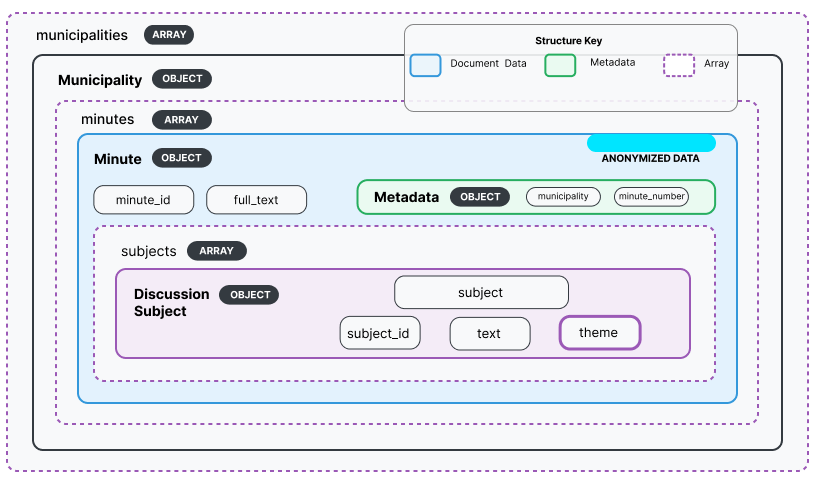

# CitiLink-Summ: A Benchmark for Summarization of Discussion Subjects in European Portuguese Municipal Meeting Minutes
[](LICENSE)
[](https://www.python.org/downloads/)
[](https://pytorch.org/)
[](https://huggingface.co/docs/transformers)
[]


Official repository for the paper submission  
**“CitiLink-Summ: A Benchmark for Summarization of Discussion Subjects in European Portuguese Municipal Meeting Minutes”**  
for **The Web Conference (WWW) 2026**.

This repository provides a **dataset sample**, **baseline implementations**, and the **summarization guidelines** used during data creation.

---

## 🧠 Overview

**CitiLink-Summ** introduces a new **benchmark dataset** for the summarization of *discussion subjects* extracted from European Portuguese municipal meeting minutes.  
It enables research on:

- domain-specific summarization,  
- low-resource languarge - European Portuguese,  
- structured municipal meeting documentation,  
- evaluation of LLMs and Encoder-Decoder Architectures under constrained public-administration contexts.

The benchmark includes manually curated abstractive summaries that condense the essential decisions and key points of municipal meetings.

---

## 📊 Project Status

The benchmark and the full set of baselines are implemented and reproducible.  
The *complete dataset* will be released soon.

---

## 🧩 Technology Stack

- **Language:** Python  
- **Frameworks:** PyTorch, Hugging Face Transformers  
- **Models:** BART (base/large), PRIMERA, **PTT5**, Gemini Flash, Qwen  

---

## 🏗️ Architecture


The CitiLink-Summ workflow consists of:

1. **Dataset Preparation**  
   Processing of discussion subjects, metadata and expert-written summaries.

2. **Baseline Summarization**  
   Implementations using encoder–decoder Transformers, long-context models, and LLM APIs.

3. **Automatic Evaluation**  
   Metrics include ROUGE, BERTScore, BLEU, Meteor, and others.

---

## 📁 Repository Structure

```
Citilink-Summ/
├── baselines/
│ ├── train_models/ # Training scripts for BART, PRIMERA, PTT5, etc.
│ ├── generate_summaries/ # Zero-shot and fine-tuned summary generation
│ └── Evaluation/ # ROUGE, BLEU, BERTScore, MoverScore, etc.
│
├── docs/
│ └── assets/
│ ├── architecture.png
│ ├── header.png
│ └── structure.png
│
├── sample/ # Sample subset of the dataset (train/val/test)
│ ├── train/
│ ├── val/
│ └── test/
│
├── Summarization_guidelines.pdf
├── LICENSE
└── README.md
```

---

## ⚙️ Installation and Usage

### 1. Clone the repository
```bash
git clone https://github.com/inesctec/citilink-summ.git
cd citilink-summ
```

### 2. Create and activate a virtual environment
```bash
python -m venv venv
source venv/bin/activate   # Linux/macOS
venv\Scripts\activate      # Windows
```

### 3. Install dependencies
```bash
pip install -r baselines/requirements.txt
```

### 4. Run a baseline model

---

## 📘 Dataset

A **sample subset** of the CitiLink-Summ dataset is provided under `sample/`.  

The **full dataset** will be released **soon**, following the structure illustrated below:



---

## 📄 License
This project is licensed under the **Creative Commons BY-NC-SA 4.0 License** — see the `LICENSE` file for details.

---

## 📚 Documentation and Resources

- **CitiLink Project:** [https://citilink.inesctec.pt/](https://citilink.inesctec.pt/)  
- **CitiLink-Summ Paper (preprint):** *Coming soon*  
- **CitiLink Dataset:** *Coming soon*

---

## 👥 Credits and Acknowledgements

Developed by **INESC TEC** (Institute for Systems and Computer Engineering, Technology and Science),  
in collaboration with:

- University of Beira Interior (UBI)  
- University of Porto (UP)
- Portuguese Foundation for Science and Technology (FCT)    

---

## 📬 Contact

For support, questions, or collaboration inquiries:

- **Email:** ricardo.campos@ubi.pt & miguel.alexandre.marques@ubi.pt  
- **Corresponding Authors:** Ricardo Campos (INESC TEC & UBI) & Miguel Marques (INESC TEC & UBI)

---

## Acknowledgement

This work was funded within the scope of the project  CitiLink, with reference 2024.07509.IACDC, which is co-funded by Component 5 - Capitalization and Business Innovation, integrated in the Resilience Dimension of the Recovery and Resilience Plan within the scope of the Recovery and Resilience Mechanism (MRR) of the European Union (EU), framed in the Next Generation EU, for the period 2021 - 2026, measure RE-C05-i08.M04 - ``To support the launch of a programme of R\&D projects geared towards the development and implementation of advanced cybersecurity, artificial intelligence and data science systems in public administration, as well as a scientific training programme,'' as part of the funding contract signed between the Recovering Portugal Mission Structure (EMRP) and the FCT - Fundação para a Ciência e a Tecnologia, I.P. (Portuguese Foundation for Science and Technology), as intermediary beneficiary. https://doi.org/10.54499/2024.07509.IACDC

